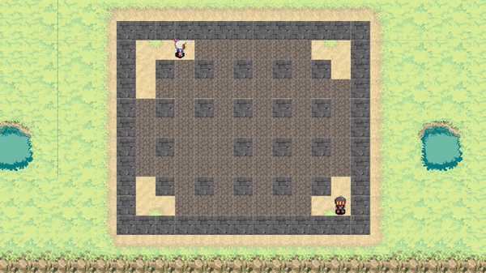

<h1 id="title" align="center">Bomberman Replica</h1>

<h3 align="center">:video_game: A SNES Bomberman Replica video game :bomb:</h3>

<p align="center">
  <a href="#title"></a>
  <a href="#title"></a>
</p>

<p align="center">
  <a href="#overview">Introduction</a> •
  <a href="#demo">Demo</a> •
  <a href="#controls">Controls</a> •
  <a href="#changingControls">Changing Controls</a>
</p>

<h1 id="introduction">Introduction</h1>
This is a replica of the "Super Bomberman" Game in SNES.

The idea is to place a bomb near a wall to destroy it and use the same bomb to defeat the second player.

<h1 id="demo">Demo</h1>
<p align="center">
  
</p>


<h1 id="controls">Controls</h1>

It is a Two-Player game.

<center>

| Player 1 Controls || Player 2 Controls |
|--|-|--|
|<table><tr><th>Key</th><th>Description</th></tr><tr align="center"><td>UpArrowKey</td><td>Move Up</td></tr><tr align="center"><td>DownArrowKey</td><td>Move Down</td></tr><tr align="center"><td>LeftArrowKey</td><td>Move Left</td></tr><tr align="center"><td>RightArrowKey</td><td>Move Right</td></tr><tr align="center"><td>SpaceBar</td><td>Place Bomb</td></tr> </table>|<span>&nbsp;&nbsp;&nbsp;&nbsp;&nbsp;&nbsp;&nbsp;&nbsp;</span>| <table> <tr><th>Key</th><th>Description</th></tr><tr align="center"><td>NumPad 8</td><td>Move Up</td></tr><tr align="center"><td>NumPad 5</td><td>Move Down</td></tr><tr align="center"><td>NumPad 4</td><td>Move Left</td></tr><tr align="center"><td>NumPad 6</td><td>Move Right</td></tr><tr align="center"><td>End Key</td><td>Place Bomb</td></tr> </table>|

</center>

<h1 id="changingControls">Changing Controls</h1>
You can change the controls by making changes in the following files present in <i>/Assets/Scripts</i> directory.

<h4>Player One</h4>

```javascript
○ Player One Movement | Player1.cs
○ Player One Bomb     | BombSpawner.cs
```
<h4>Player Two</h4>

```javascript
○ Player Two Movement | Player2Script.cs
○ Player Two Bomb     | Player2BombSpawner.cs
```

